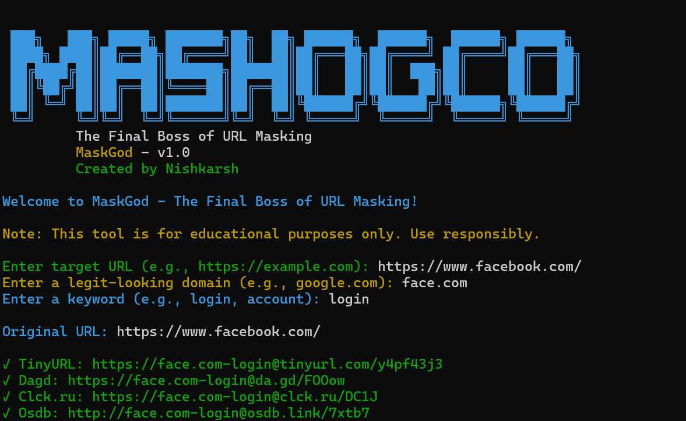

# Project Title
🕵️‍♂️ URLMasking(**MASKGOD**)

A powerful tool to mask URLs with clean and legit-looking links. Designed for educational and ethical hacking use cases.


## 🙏 Acknowledgements

I would like to thank the following resources and individuals who inspired or supported the development of **MASKGOD**:

- [Inspired by SPYBOY's Facad1ng](https://github.com/spyboy-productions/Facad1ng)
- [Open Source Community](https://opensource.guide/)
- [shields.io](https://shields.io/) — For generating beautiful README badges
- [GitHub Docs](https://docs.github.com/) — For clear documentation and best practices
- [Readme.so](https://readme.so/) — For helping scaffold professional README files
- [Markdown Guide](https://www.markdownguide.org/) — For mastering markdown formatting
- Fellow developers and ethical hackers who continue to share knowledge and build cool things.


## 🚀 Badges


## 👤 Authors

- **Nishkarsh Pandey** ⇒ [@Nish2005karsh](https://www.github.com/Nish2005karsh)

## Appendix

Overview
Purpose: Mask URLs by combining them with a domain and keyword. Includes URL shortening and QR code generation.

Features
Mask URLs with a chosen domain and keyword.
Shorten URLs with services like TinyURL, Dagd, and Clck.ru.
Generate QR codes for masked URLs.
Save results to a JSON file.
``` 
pip install -r requirements.txt
```

## Screenshots




---

## 📦 Features

- Mask phishing links with trusted domains
- Add custom keywords (like “giveaway” or “login”)
- Simple to use
- Works on Linux

## Customization
To add more URL shortening services:

Open the maskgod.py file.

Locate the shorteners list.

Add any additional URL shortening services by following the same pattern as TinyURL, Dagd, or Clck.ru. For example, here's the updated list with all the services you mentioned:
```
shorteners = [
    ("Adf.ly", pyshorteners.Shortener().adfly),
    ("Bit.ly", pyshorteners.Shortener().bitly),
    ("Chilp.it", pyshorteners.Shortener().chilpit),
    ("Clck.ru", pyshorteners.Shortener().clckru),
    ("Cutt.ly", pyshorteners.Shortener().cuttly),
    ("Da.gd", pyshorteners.Shortener().dagd),
    ("Git.io", pyshorteners.Shortener().gitio),
    ("Is.gd", pyshorteners.Shortener().isgd),
    ("NullPointer", pyshorteners.Shortener().nullpointer),
    ("Os.db", pyshorteners.Shortener().osdb),
    ("Ow.ly", pyshorteners.Shortener().owly),
    ("Po.st", pyshorteners.Shortener().post),
    ("Qps.ru", pyshorteners.Shortener().qpsru),
    ("Short.cm", pyshorteners.Shortener().shortcm),
    ("Tiny.cc", pyshorteners.Shortener().tinycc),
    ("TinyURL.com", pyshorteners.Shortener().tinyurl),
]

```
---

## 🛠️ Installation

```bash
git clone https://github.com/Nish2005karsh/URLMasking
cd URLMasking
pip install -r requirements.txt
```
## Contact
Contact
Created by Nishkarsh - feel free to reach out via GitHub issues or email for questions, suggestions, or feedback

## Contributing
Contributing
Feel free to fork the repository and submit pull requests for any improvements or additional features. If you encounter bugs or have suggestions, open an issue and we’ll look into it!

## ⭐ Support the Project
If you find this tool helpful, please give it a star! It helps the project gain visibility and shows your support.